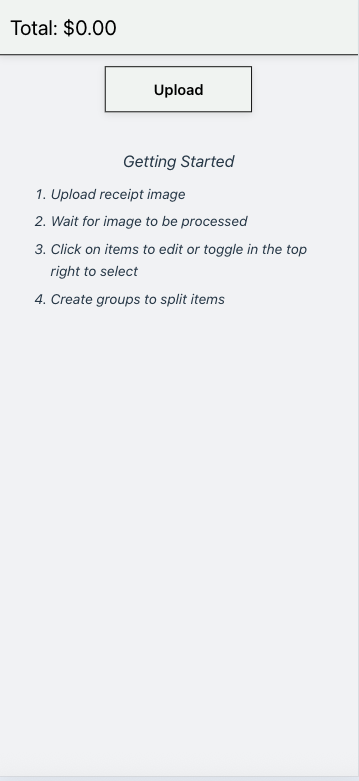
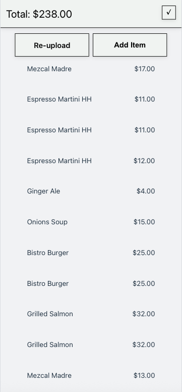
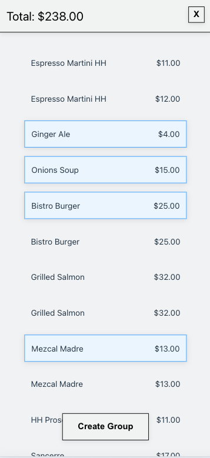
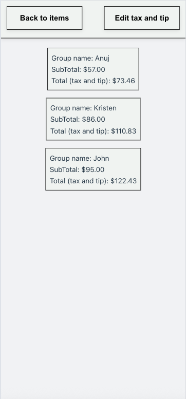

# Receipt Parser Frontend

A Vite + Vue frontend for uploading receipt images, reviewing parsed items, and
grouping items for sharing or split purposes. This repo is the UI layer only and
expects a compatible backend API for receipt parsing.

## Overview

The app lets users upload a receipt image, view the parsed line items, and
optionally group items. Parsing and OCR are handled by a backend service; the
frontend focuses on input, display, and lightweight interaction.

## Usage

1. Upload a receipt to get individual items




2. Select items to create groups




## API Expectations

The frontend expects a backend endpoint that accepts a receipt image and returns
structured items. By default it posts a `multipart/form-data` request with an
`image` field and expects an `items` list in the response.

If your backend uses a different URL or response shape, update the API base URL
and mapping in the store.

## Running Locally

Prerequisites:

- Node.js 18+

Install and run:

```sh
npm install
npm run dev
```

Build:

```sh
npm run build
```

Preview:

```sh
npm run preview
```

## Project Structure

- `src/components`: UI components (uploader, list items, buttons)
- `src/stores`: state management and API calls
- `src/views`: page-level layout
